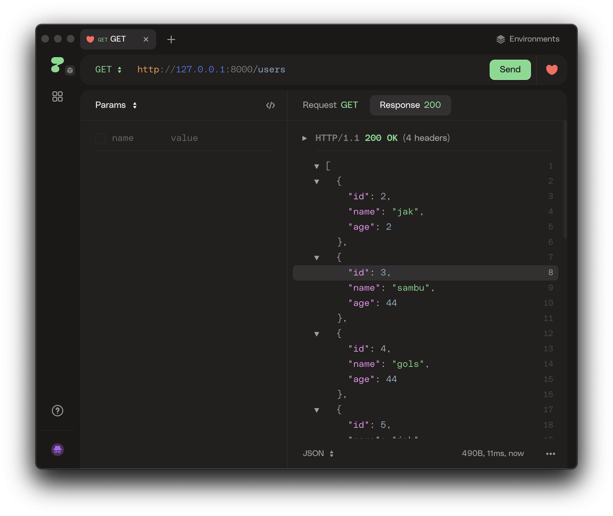
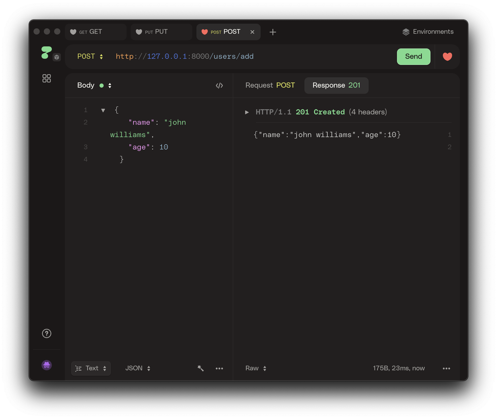
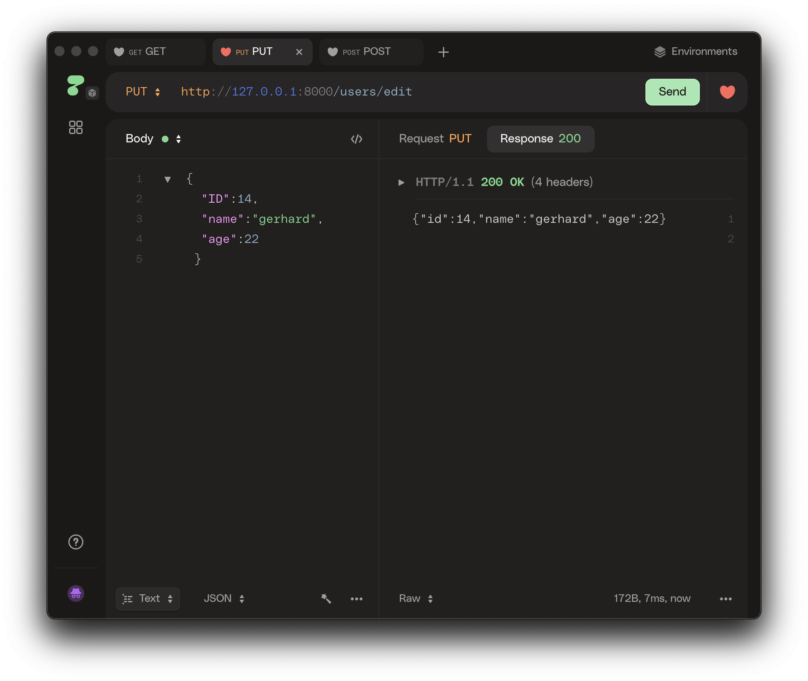
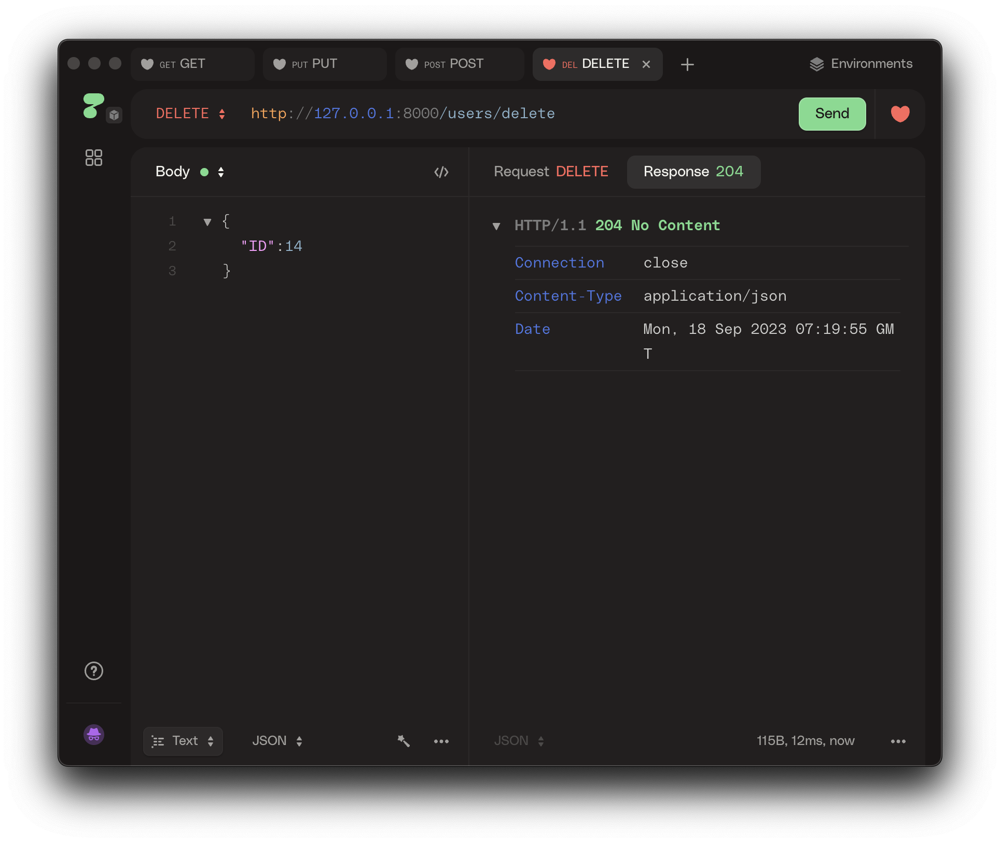
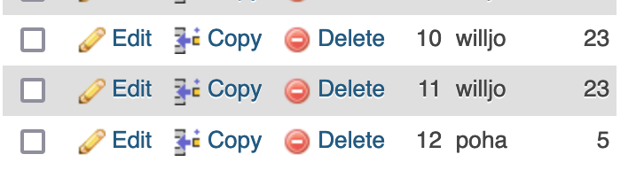

# Simple REST API with golang(Still don't have name)

A simple Golang web application that demonstrates handling HTTP requests (GET, POST, PUT, DELETE) and connecting to a local MySQL database.

## Prerequisites

Before you begin, ensure you have met the following requirements:

- Go installed on your local machine.
- MySQL database server (e.g., MariaDB) installed and running locally.
- Configuration details for your database connection (username, password, database name).

## Getting Started

To get this project up and running on your local machine, follow these steps:

1. Clone the repository:

   ```sh
   git clone https://github.com/askpradana/simple-go-rest
   cd your-golang-project
   ```

2. Create a `.env` file and add your database connection details:

   ```env
   DB_USERNAME=root
   DB_PASSWORD=yourpassword
   DB_NAME=yourdbname
   ```

3. Build and run the project:

   ```sh
   go build -o main .
   ./main
   ```

   Your Golang web application should now be running locally at `http://localhost:8000`.

## HTTP Request Handlers

This project includes HTTP request handlers for basic CRUD operations:

- `GET /users`: Retrieve a list of users.
- `POST /users/add`: Add a new user.
- `PUT /users/edit`: Edit an existing user.
- `DELETE /users/delete`: Delete a user by ID.

## Database Connection

The project connects to a local MySQL database using the `database/sql` package. Make sure your MySQL server is running and that you have provided the correct database connection details in the `.env` file.

## Usage

You can test the API endpoints using tools like `curl`, `Postman`, or by creating your own frontend application.

### Example Requests

#### GET /users

```sh
curl http://localhost:8000/users
```




#### POST /users/add

```sh
curl -X POST -H "Content-Type: application/json" -d '{"name":"John Doe","age":30}' http://localhost:8000/users/add

```


#### PUT /users/edit

```sh
curl -X PUT -H "Content-Type: application/json" -d '{"ID":1,"name":"Updated Name","age":25}' http://localhost:8000/users/edit
```


Before(hint: from john williams to gerhard   )


After


#### DELETE /users/delete

```sh
curl -X DELETE http://localhost:8000/users/delete?id=1
```



Table after delete (hint: there are no id 14 anymore)



## Contributing

Contributions are welcome! Please open an issue or create a pull request if you find any bugs or want to improve this project.

## License

This project is licensed under the MIT License. See the [LICENSE](LICENSE.txt) file for details.
